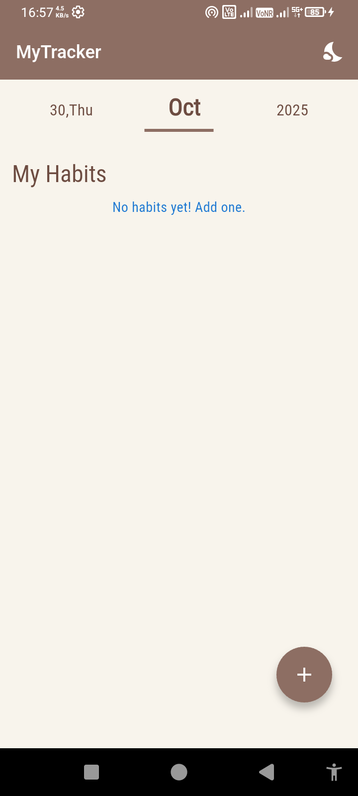
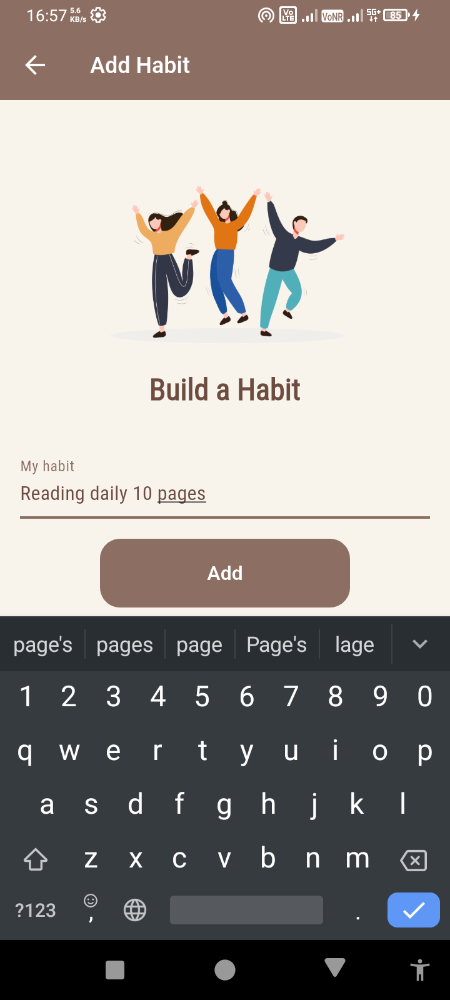
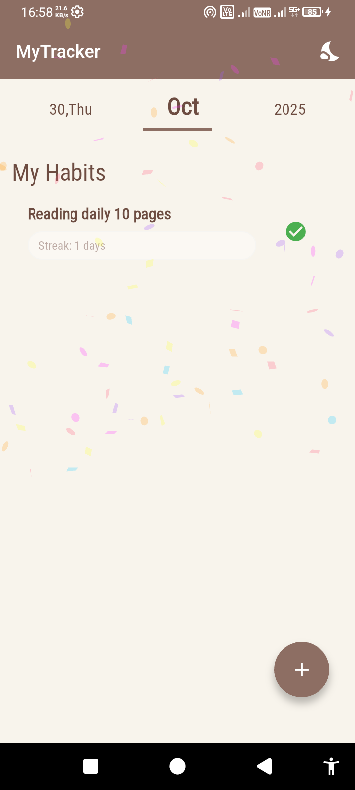
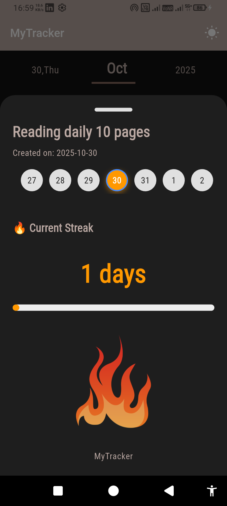
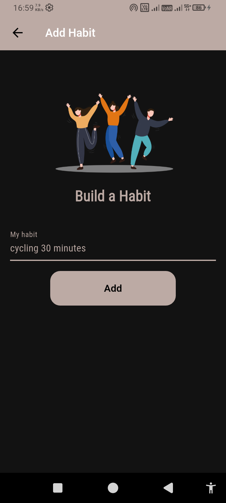

# habit tracker

A simple yet interactive Flutter application that helps users build better daily habits by tracking progress, showing streaks, and celebrating achievements with fun animations.
Built with GetX for state management and navigation, and SharedPreferences for local persistence.


## 📸 Preview

<p align="center">





</p>

## ✨ Features

### 🗓️ Habit Management

- Add, view, and manage daily habits effortlessly.

- Mark habits as done or not done each day.

- Automatically calculates daily and weekly streaks.

### 🏆 Streak System & Gamification

- Displays current streak count and highlights milestones.

- Animated streak progress for motivation.

- Celebrates completions with confetti explosions and bounce effects for rewarding feedback.

### 🌙 Theme Support

- Light & Dark Mode toggle using GetX ThemeController.

- Automatically saves theme preference in SharedPreferences.

### 🎉 Animated Feedback

- Party cracker/confetti animation plays when a habit is completed.


### 💾 Data Persistence

- All habits, streaks, and completion states are stored locally via SharedPreferences — your progress is saved even after restarting the app.

### 📆 Calendar & Weekly View

- Weekly streak report displays the current week’s days.

- Highlights current day and completed days with colored circular indicators.

- Smooth horizontal scroll for viewing weeks.

## 🧰 Tools & Technologies Used

| Package / Widget                      | Description                                            |
| ------------------------------------- | ------------------------------------------------------ |
| **GetX**                              | State management, dependency injection, and navigation |
| **SharedPreferences**                 | Local data persistence for theme and habits            |
| **Confetti / flutter_confetti**       | Fun celebration animations when completing habits      |
| **Intl**                              | Date formatting for week and streak display            |
| **LayoutBuilder / MediaQuery**        | Responsive UI handling                                 |
| **AnimatedContainer / AnimatedScale** | Smooth habit completion animations                     |

---

## 🚀 Getting Started

To run this project:

```bash
flutter pub get
flutter run
```

# 👨‍💻 Author
- [Email](purushottam1931@gmail.com)

- [linkedin](https://www.linkedin.com/in/purushottamsahu/)
